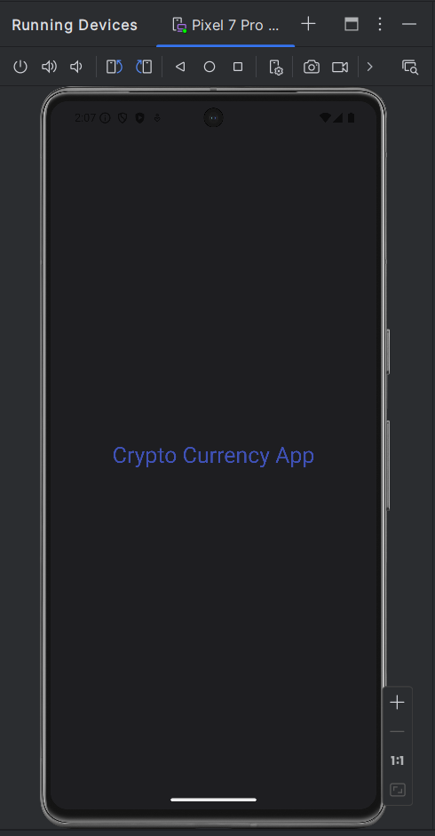
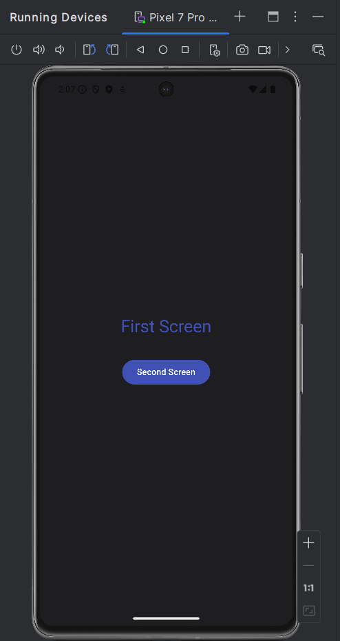
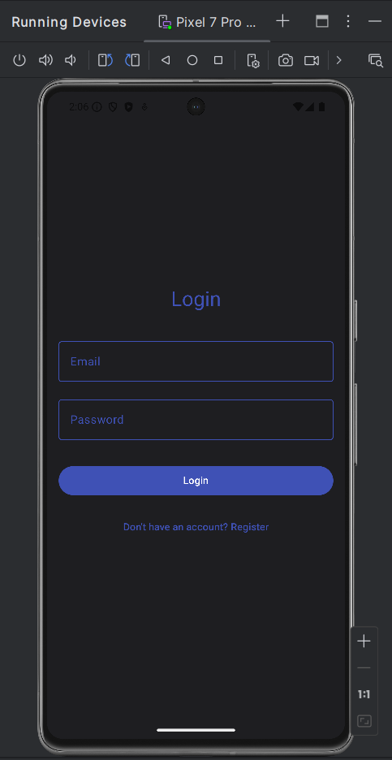
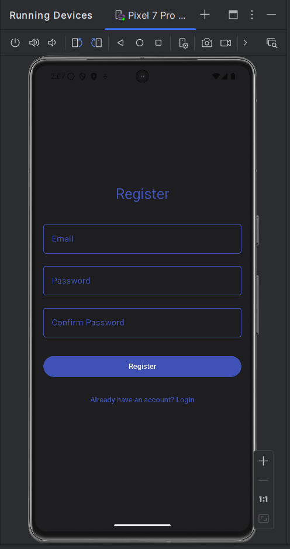
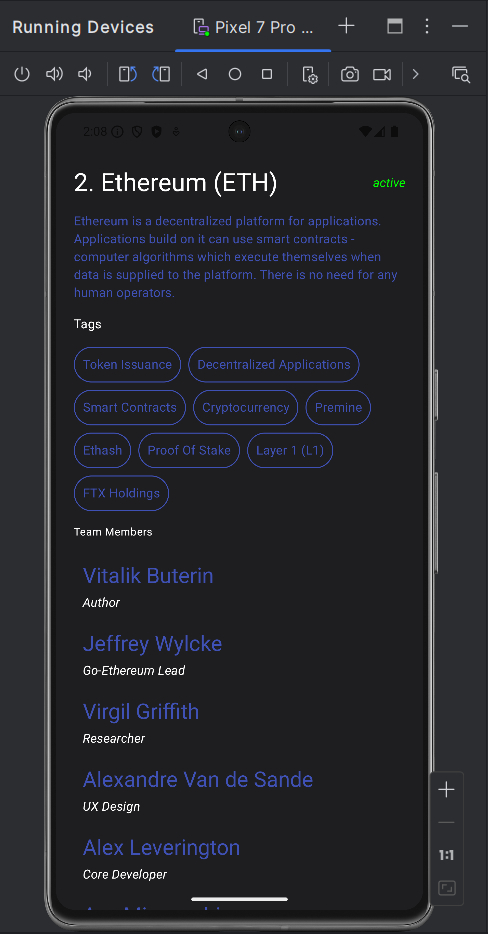

Cryptocurrency Information App
# Cryptocurrency Information App


## Project Overview
A comprehensive Android application built with Kotlin that provides users with detailed cryptocurrency information. The app features user authentication, a dynamic coin list, and detailed coin information sourced from the CoinPaprika API.


## Table of Contents
1. [Features](#Features)
2. [Technologies](#Technologies)
3. [Project Structure](#Project)
4. [Setup and Installation](#Setup)
5. [Upcoming](#Upcoming)
6. [API Reference](#API)
7. [Screenshots](#Screenshots)
8. [Contributor](#Contributor)
9. [Contributing](#Contributing)
10. [Acknowledgments](#Acknowledgments)


## Features
- Splash Screen
- Firebase Authentication (Login/Register)
- Coin List with 150+ Cryptocurrencies
- Detailed Coin Information
- Responsive UI with Jetpack Compose


## Technologies
- **Language**: Kotlin
- **Architecture**: MVVM Clean Architecture
- **UI**: Jetpack Compose
- **Dependency Injection**: Dagger Hilt
- **Networking**: CoinPaprika API
- **Authentication**: Firebase Authentication


## Project Structure
```
src
├── main
│   ├── java/com/project/cryptocurrencyapp
│   │   ├── common
│   │   ├── data
│   │   │   ├── dto
│   │   │   ├── implementation
│   │   │   └── service
│   │   ├── di
│   │   ├── domain
│   │   │   ├── model
│   │   │   ├── repository
│   │   │   └── usecase
│   │   ├── presentation
│   │   │   ├── navigation
│   │   │   ├── screen
│   │   │   └── viewmodel
│   │   └── ui
│   │       └── theme
│   └── res
│       ├── drawable
│       ├── mipmap
│       └── values
```


## Setup and Installation
1. Clone the repository:
```bash
git clone https://github.com/KakhaPh/mobileApplication/tree/main/cryptocurrencyapp
```
2. Open the project in Android Studio
3. Ensure you have the latest Android SDK and Kotlin plugin
4. Add your Firebase configuration file (`google-services.json`)
5. Sync Gradle and run the app


## Upcoming
- Real-time charts of single Coins
- 

## API Reference
- **CoinPaprika API**: Used for fetching cryptocurrency data
- Endpoints: Coin List, Coin Details


## Screenshots

### Splash Screen


### First Screen


### Login Screen


### Register Screen


### Coins List


### Coin Detail



## Contributor
- **[Kakha Phutkaradze](https://github.com/KakhaPh/)**   


## Contributing

We welcome contributions to CryptoCurrencyApp! Here's how you can help:

1. Fork the repository
2. Create a feature branch (`git checkout -b feature/AmazingFeature`)
3. Commit your changes (`git commit -m 'Add some AmazingFeature'`)
4. Push to the branch (`git push origin feature/AmazingFeature`)
5. Open a Pull Request

Please ensure your code follows our coding standards and includes appropriate tests.

## Acknowledgments
- CoinPaprika API
- Firebase
- Jetpack Compose
